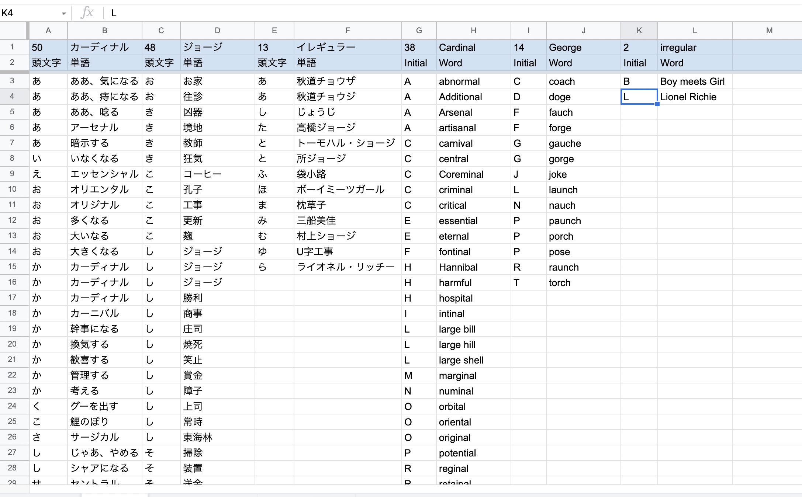
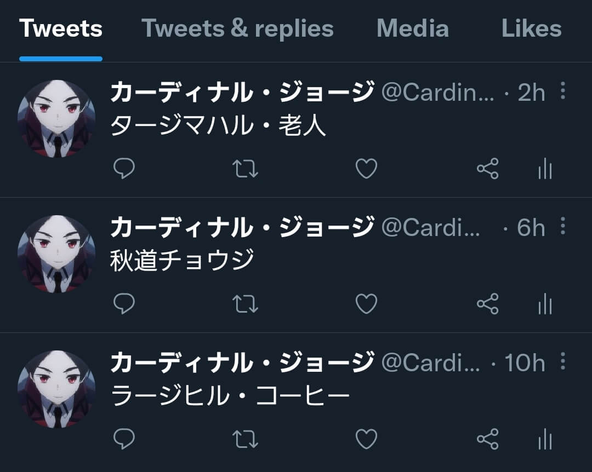
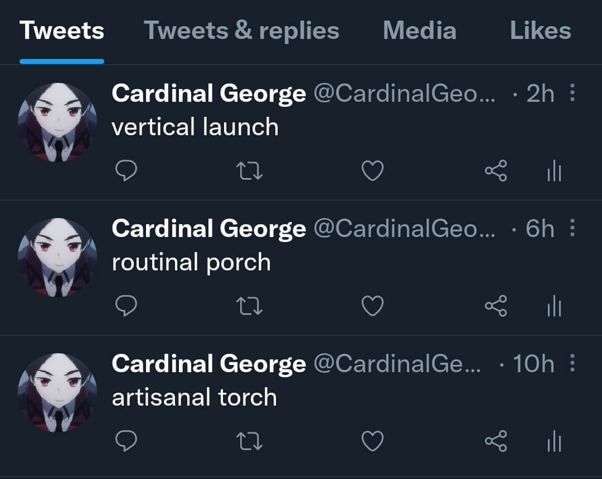
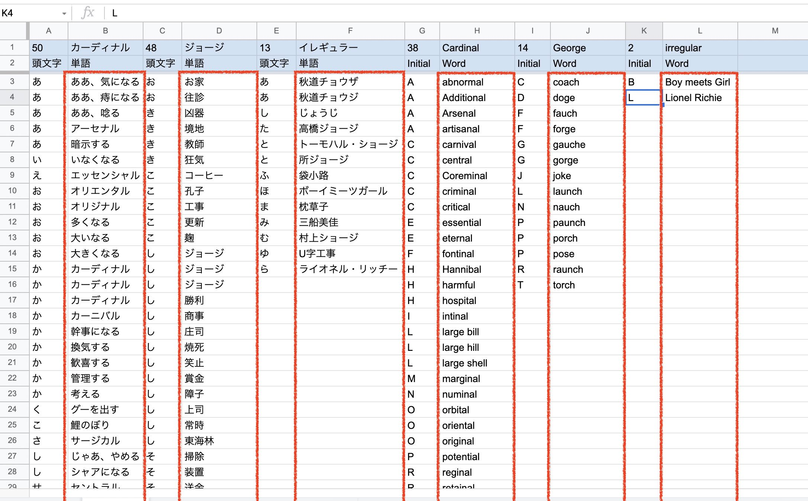

# TweetBotCardinalGeorge

# Table of Contents

- [TweetBotCardinalGeorge](#tweetbotcardinalgeorge)
- [Table of Contents](#table-of-contents)
- [What are Functions](#what-are-functions)
  - [`selectWordsToTweet`](#selectwordstotweet)
  - [`decideSentenceToTweet`](#decidesentencetotweet)
  - [`postTweet`](#posttweet)
- [Opearation](#opearation)

# What are Functions

This bot tweets with contents in the spreadsheet at random.

Tweets in Japanese.

Tweets in English.

## `selectWordsToTweet`

Selects words to tweet from spreadsheet.

Words can be following pattern (in the case of Japanese).

- `B` column and `D` column.
- `F` column only.

## `decideSentenceToTweet`

Decides sentence to tweet from array that contains words.

## `postTweet`

Tweets in Japanese or English.

# Opearation

After you execute `main` function, this bot tweets with words at random.
